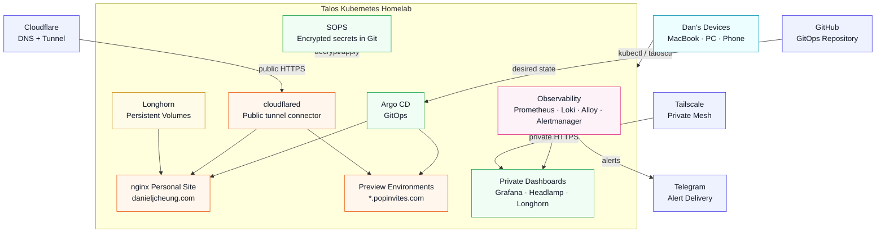

# Talos Kubernetes Homelab

This repository documents my bare-metal Kubernetes homelab built with **Talos Linux** on small form factor PCs.

The goal of this project is to learn Kubernetes and platform engineering by running a real cluster on real hardware, not just local containers or cloud tutorials. I chose Talos Linux because it is purpose-built for Kubernetes, immutable, API-managed, and closer to modern production infrastructure than a traditional Ubuntu server install.

## Current Status

✅ Hardware acquired  
✅ Talos Linux booted from USB  
✅ Talos installed to the internal SSD  
✅ Kubernetes cluster bootstrapped  
✅ Second Talos node added as a worker  
✅ First nginx workload deployed and exposed with NodePort  
✅ Public GitHub repository published  
✅ Argo CD installed inside the cluster  
✅ First GitOps app synced from GitHub  
✅ Private Argo CD access configured over Tailscale  
✅ Headlamp dashboard installed and exposed privately over Tailscale  
✅ Personal website deployed through GitOps-managed nginx  
✅ Cloudflare Tunnel serving `danieljcheung.com` and `www.danieljcheung.com` without router port forwarding
✅ First real Kubernetes incident documented with operations lessons
✅ Observability stack installed: Prometheus, Grafana, Alertmanager, Loki, and Alloy
✅ SOPS workflow added for encrypted Git-tracked secrets
✅ Longhorn installed for Kubernetes-native persistent storage
✅ Longhorn external backups configured to AWS S3 and restore-tested
✅ CloudNativePG Postgres created for the Company Brain app
✅ PreviewApp operator GitOps setup configured
🔄 Third node / control-plane expansion in progress
⏭️ Next: finish converting the former worker into the third control-plane member

## Hardware

- **Control plane:** `desktop-j7rbie4`
  - Intel Core i5-8500T
  - 16GB RAM
  - 256GB SSD
  - Ethernet
- **Worker:** `desktop-bvomtdn`
  - Dell OptiPlex 3070-class small form factor node
  - Intel Core i5 9th gen
  - 16GB RAM
  - 256GB SSD
  - Ethernet
- **New node:** hostname pending
  - 32GB RAM
  - 1TB storage
  - Added as the most capable node for the move toward a three-node control-plane cluster

The intended end state is three Talos nodes, all acting as control-plane members and all schedulable for homelab workloads. This gives etcd a real three-member quorum while still using all available hardware for applications.

## Architecture

See [Architecture](docs/14-architecture.md) for the larger system context and cluster container view.

## Why Talos?

I originally considered Ubuntu Server with k3s, but decided to use Talos Linux because it gives the project a stronger infrastructure focus.

Talos is different from a normal Linux server:

- No SSH into the node
- No traditional package manager
- Minimal immutable operating system
- Managed through `talosctl`
- Designed specifically for Kubernetes
- Smaller attack surface
- Better fit for learning modern Kubernetes operations

## Setup Journey

The first machine arrived with Windows preinstalled, so the first major step was wiping the internal drive and replacing it with Talos Linux. The second node was later added as a dedicated worker using the original cluster's worker machine config. The cluster is now being expanded toward a three-node control-plane layout.

High-level process:

1. Downloaded the Talos `metal-amd64.iso`
2. Flashed it to a USB drive with Raspberry Pi Imager
3. Booted the homelab machine from USB
4. Found the node IP on the Talos dashboard
5. Generated Talos machine configs from my Mac
6. Enabled scheduling on the control plane for a single-node cluster
7. Applied the Talos control plane config
8. Installed Talos to the internal SSD
9. Rebooted into the installed system
10. Bootstrapped Kubernetes
11. Confirmed the cluster was up with `kubectl`

## Documentation

- [Hardware and Goals](docs/01-hardware-and-goals.md)
- [Talos Linux Installation](docs/02-talos-linux-install.md)
- [Admin Workstation Setup](docs/03-admin-workstation-setup.md)
- [Cluster Bootstrap](docs/04-cluster-bootstrap.md)
- [GitOps Roadmap](docs/05-gitops-roadmap.md)
- [Argo CD GitOps Setup](docs/06-argocd-gitops.md)
- [Private Access with Tailscale](docs/07-tailscale-private-access.md)
- [Kubernetes Dashboards](docs/08-kubernetes-dashboards.md)
- [Personal Website and Cloudflare Tunnel](docs/09-personal-site-cloudflare.md)
- [Kubernetes Operations Lessons](docs/10-kubernetes-operations-lessons.md)
- [Observability Stack](docs/11-observability-stack.md)
- [SOPS Secrets Workflow](docs/12-sops-secrets-workflow.md)
- [Longhorn Storage](docs/13-longhorn-storage.md)
- [Architecture](docs/14-architecture.md)
- [CloudNativePG for Company Brain](docs/15-cloudnativepg-company-brain.md)
- [PreviewApp Operator GitOps Setup](docs/16-previewapp-operator-gitops.md)
- [Build Log](docs/build-log.md)
- [nginx Personal Website](manifests/nginx/README.md)
- [Cloudflare Tunnel Manifests](manifests/cloudflare-tunnel/README.md)
- [Monitoring Manifests](manifests/monitoring/README.md)
- [Resume Notes](docs/resume-notes.md)

## Skills Demonstrated

- Kubernetes administration
- Talos Linux / immutable infrastructure
- Bare-metal cluster operations
- `talosctl` and `kubectl`
- Linux/Kubernetes networking concepts
- Infrastructure documentation
- GitOps with Argo CD
- Private admin access with Tailscale
- Kubernetes dashboard operations with Headlamp
- Static website hosting on Kubernetes
- Cloudflare Tunnel public access without port forwarding
- Kubernetes persistent storage with Longhorn
- SOPS-based encrypted secret management
- Architecture documentation with Mermaid diagrams
- Security-aware system design

## Next Steps

- Pin and harden the `cloudflared` deployment
- Deploy n8n and Postgres through GitOps
- Enable recurring Longhorn backup jobs for selected volumes
- Deploy and back up the first real stateful workload
- Configure Alertmanager routes and production-grade alerting
- Deploy security-focused workloads for experimentation
