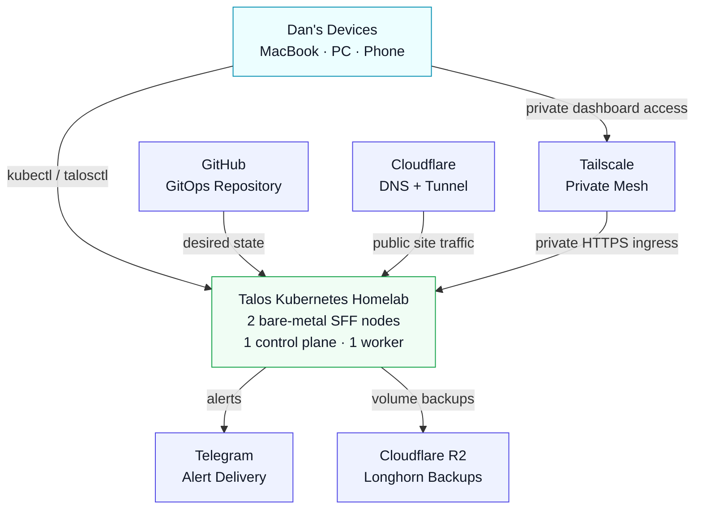

# Homelab Architecture

This document shows the current architecture of the Talos Kubernetes homelab.

## System Context



## Cluster Container View

```mermaid
flowchart TB
  github["GitHub Repo"]
  cloudflare["Cloudflare Edge"]
  tailscale["Tailscale Mesh"]
  telegram["Telegram"]
  s3["Cloudflare R2<br/>Longhorn Backups"]

  subgraph cluster["Talos Kubernetes Homelab"]
    direction TB

    subgraph nodes["Physical Nodes"]
      direction LR
      cp["desktop-j7rbie4<br/>control plane"]
      worker["desktop-bvomtdn<br/>worker"]
    end

    subgraph gitops["GitOps + Workloads"]
      direction LR
      argocd["Argo CD<br/>Sync controller"]
      nginx["nginx Site<br/>danieljcheung.com"]
      future["Future Apps<br/>n8n"]
      companyBrain["Company Brain<br/>Next.js app planned"]
      postgres["CloudNativePG<br/>Company Brain Postgres"]
      previewappOperator["PreviewApp Operator<br/>previewapp-system"]
      previewapps["PreviewApp Previews<br/>previews namespace"]
      whisper["Whisper<br/>Private clipboard"]

      argocd --> nginx
      argocd --> whisper
      argocd --> postgres
      companyBrain --> postgres
      argocd -. planned .-> future
      argocd --> previewappOperator
      previewappOperator -. creates/reconciles .-> previewapps
    end

    subgraph access["Access Layer"]
      direction LR
      cloudflared["cloudflared<br/>Tunnel connector"]
      tsIngress["Tailscale Ingress<br/>Private dashboards"]
      ingressNginx["ingress-nginx<br/>Ingress Controller"]
    end

    subgraph observability["Observability"]
      direction LR
      alloy["Alloy<br/>Log collector"]
      loki["Loki<br/>Logs"]
      prometheus["Prometheus<br/>Metrics"]
      grafana["Grafana<br/>Dashboards"]
      alertmanager["Alertmanager<br/>Routing"]

      alloy --> loki --> grafana
      prometheus --> grafana
      prometheus --> alertmanager
    end

    subgraph platform["Platform Services"]
      direction LR
      headlamp["Headlamp<br/>Kubernetes UI"]
      longhorn["Longhorn<br/>Persistent storage"]
      sops["SOPS Secrets<br/>Encrypted in Git"]
    end

    longhorn --> pvcs["PVCs<br/>Stateful data"]
    postgres --> pvcs
  end

  github -->|manifests| argocd
  cloudflare -->|public HTTPS| cloudflared --> nginx
  cloudflare -->|public HTTPS *.popinvites.com| cloudflared --> ingressNginx --> previewapps
  tailscale -->|private HTTPS| tsIngress
  tsIngress --> argocd
  tsIngress --> grafana
  tsIngress --> whisper
  tsIngress --> headlamp
  tsIngress --> longhorn
  alertmanager -->|notifications| telegram
  longhorn -->|external backups| s3
  sops -. decrypt/apply from admin Mac .-> cluster

  classDef external fill:#eef2ff,stroke:#4f46e5,color:#111827
  classDef gitops fill:#fff7ed,stroke:#ea580c,color:#111827
  classDef access fill:#eff6ff,stroke:#2563eb,color:#111827
  classDef obs fill:#fdf2f8,stroke:#db2777,color:#111827
  classDef platform fill:#f0fdf4,stroke:#16a34a,color:#111827
  classDef storage fill:#fefce8,stroke:#ca8a04,color:#111827

  class github,cloudflare,tailscale,telegram,s3 external
  class argocd,nginx,whisper,future,previewappOperator,previewapps gitops
  class cloudflared,tsIngress,ingressNginx access
  class alloy,loki,prometheus,grafana,alertmanager obs
  class headlamp,longhorn,sops platform
  class pvcs storage
```



## Access Model

- Public traffic only reaches the personal site through Cloudflare Tunnel.
- Public preview environments are exposed dynamically under subdomains of `popinvites.com` using Cloudflare wildcard routing to the internal `ingress-nginx` controller.
- Admin dashboards stay private through Tailscale ingress.
- Secrets are encrypted in Git with SOPS and applied from the trusted admin machine for now.
- Longhorn provides persistent volumes and external S3-compatible Cloudflare
  R2 backups, but the current two-node setup is still not a fully highly
  available storage/control-plane design.
- The cluster currently uses one control-plane node and one worker node. This
  is cleaner than two control-plane nodes because etcd HA should use three
  control-plane members.
## Cozy Friends public paths (gated)

The Homestead 1.3.7 hosting design adds two intentionally different routes
under `popinvites.com`:

```text
LAN Minecraft Java
  -> MetalLB Layer 2 VIP 10.0.0.254
  -> cozy-friends/homestead gameplay Service

WAN Minecraft Java
  -> mc.popinvites.com explicit DNS-only A record
  -> home WAN IPv4 -> pending Rogers TCP 25565 rule
  -> talos-ssy-pdo (10.0.0.105)
  -> gameplay Service externalIPs: [10.0.0.105]

Web browser
  -> proxied *.popinvites.com wildcard
  -> existing Cloudflare Tunnel -> ingress-nginx
  -> Host: cozy.popinvites.com
  -> cozy-friends-site Service
```

The gameplay Service remains the only LoadBalancer. MetalLB supplies the LAN
VIP, and `externalIPs` is the node-bound compatibility fallback for the Rogers
path; no extra proxy or NodePort is used. Kubernetes warns that
`externalIPs` may be deprecated or unsupported in future clusters, so verify
it after upgrades. The initial router rule is pending as WAN TCP `25565` ->
`10.0.0.105:25565`. Optional voice chat is not required for ordinary gameplay;
it needs a separate approved WAN UDP `24454` -> `10.0.0.105:24454` rule and
external test. Never expose RCON or administrative ports.

The `mc` record must be gray-cloud/DNS-only; `cozy` remains covered by the
existing proxied wildcard. Router rules, the allowlist, an outside-network
join, and external monitoring remain pending, so this is not a public-launch
claim. If `10.0.0.105` or `talos-ssy-pdo` fails, WAN gameplay and optional
voice chat fail even if MetalLB moves `10.0.0.254`; LAN clients retain access
through the VIP. The Minecraft world uses one StatefulSet replica and Longhorn
replica count 1. That combination is persistent storage, not high availability:
a node or disk failure can still require restore. Application-aware Restic
backups are the primary recovery artifact; Longhorn snapshots and external
backups are secondary disaster recovery. The [Cozy Friends Server runbook](19-cozy-friends-server.md)
covers operations and rollback.
