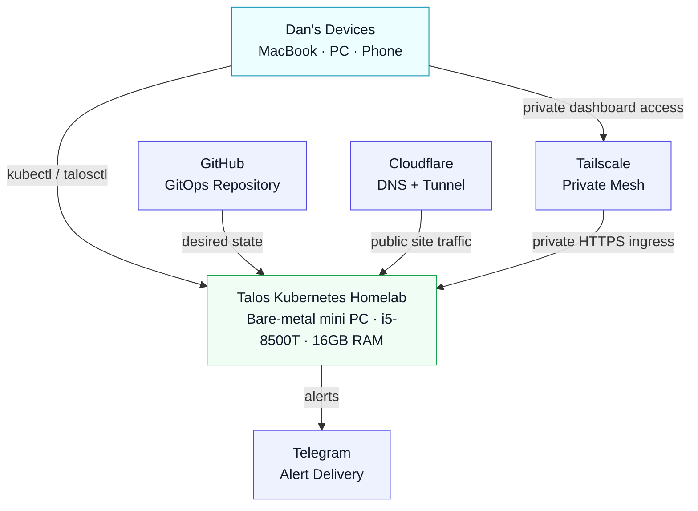
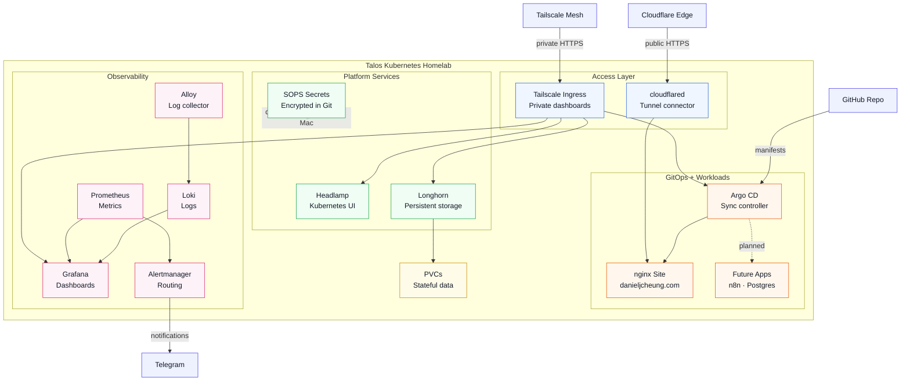

# Homelab Architecture

This document shows the current architecture of the Talos Kubernetes homelab.

## System Context

## Cluster Container View

## Access Model

- Public traffic only reaches the personal site through Cloudflare Tunnel.
- Admin dashboards stay private through Tailscale ingress.
- Secrets are encrypted in Git with SOPS and applied from the trusted admin machine for now.
- Longhorn provides persistent volumes, but the current single-node setup is not highly available until more nodes are added.
